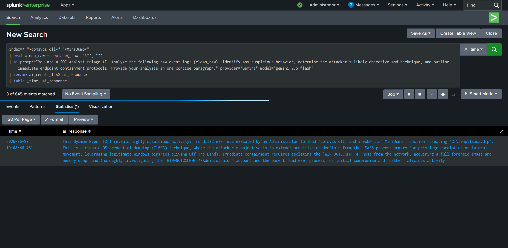
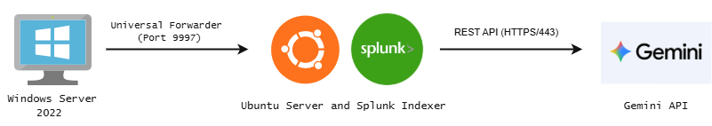

# AI-Enhanced SIEM for Threat Detection

**Author:** David Liu  
**Contact:** liudavid469@gmail.com | [LinkedIn](https://linkedin.com/in/david-liu-796b41382) | [GitHub](https://github.com/dawei2077)

  
*Real-time detection with automated analysis generated by the Gemini API.*

---

## Table of Contents
1. [Project Summary](#1-project-summary)
2. [Technology Stack](#2-technology-stack)
3. [Architecture and Topology](#3-architecture-and-topology)
4. [Engineering Deep Dive](#4-engineering-deep-dive)
5. [AI SOC](#5-ai-soc)
6. [Challenges & Takeaways](#6-challenges--takeaways)
7. [Future Mitigation Strategies](#7-future-mitigation-strategies)
8. [Deployment Guide (Step-by-Step)](#8-deployment-guide-step-by-step)

---

## 1. Project Summary
* **The Problem:** SOC analysts face extreme alert fatigue and delayed response times when investigating complex "Living off the Land" (LotL) threats.
* **The Solution:** Built a SIEM pipeline integrating Google's Gemini AI through the Splunk AI Toolkit to analyze logs and map containment strategies.
* **The Impact:** Eliminated manual triage bottlenecks and drastically accelerated overall incident response time by 90%.

## 2. Technology Stack
* **SIEM and Analytics:** Splunk Enterprise 9.3.13, Splunk AI Toolkit, Search Processing Language (SPL)
* **Agent and Telemetry:** Splunk Universal Forwarder, Microsoft Sysmon (SwiftOnSecurity baseline)
* **AI Model:** Google Gemini 2.5 Flash API
* **OS and Infrastructure:** Windows Server 2022, Ubuntu Linux (VirtualBox Type-2 Hypervisor)

## 3. Architecture and Topology

  
*Data flow architecture from log generation to AI threat triage.*

1. **Windows Server 2022 / Sysmon (The Victim):** Creates highly detailed logs on all background system activity.
2. **Splunk Universal Forwarder (Secure Transport):** XML logs are transported over Port 9997 to a headless Ubuntu server for indexing.
3. **Splunk AI Toolkit and Gemini API (Analysis and Triage):** Extracts raw logs based on SPL and queries the AI for analysis.
4. **Splunk Enterprise (Output):** Splunk receives the AI's response and formats it into a table.

## 4. Engineering Deep Dive

### Telemetry Architecture and Log Ingestion
Deployed a SwiftOnSecurity Sysmon configuration to filter benign background noise and only record high-value events. Due to strict local Security Authority restrictions, the Universal Forwarder's permissions were elevated to the "Local System" account, granting kernel-level read and forward access. 

The `inputs.conf` file was engineered to capture raw XML data exactly as written:
```ini
[WinEventLog://Microsoft-Windows-Sysmon/Operational]
disabled = false
renderXml = true
index = main
```

### Threat Simulation
Simulated a post-breach scenario with an attacker attempting credential dumping from the Windows memory vault (`lsass.exe`). To bypass standard antivirus, the built-in Windows binary `rundll32.exe` was used to execute the dump in a virtual environment:
```cmd
rundll32.exe C:\windows\System32\comsvcs.dll, MiniDump <PID> C:\temp\lsass.dmp full
```

## 5. AI SOC

Raw XML logs contained double quotes that broke Splunk's Search Processing Language (SPL). To resolve this, `eval` and `replace` commands were used to sanitize the logs before passing them to the LLM prompt for real-time threat detection and incident response:

```spl
index=* "*comsvcs.dll*" "*MiniDump*"
| eval clean_raw = replace(_raw, "\"", "")
| ai prompt="You are a SOC Analyst triage AI. Analyze the following raw event log: {clean_raw}. Identify any suspicious behavior, determine the attacker's likely objective and technique, and outline immediate endpoint containment protocols. Provide your analysis in one concise paragraph." provider="Gemini" model="gemini-2.5-flash"
| rename ai_result_1 AS ai_response
| table _time, ai_response
```

## 6. Challenges & Takeaways
* **Hardware Instruction Roadblocks:** Splunk 10.4 failed to save the LLM configuration due to an AVX hardware instruction block from the host OS (Windows 11). Successfully pivoted by downgrading to Splunk 9.3.13, resolving the MongoDB kvstore crash without compromising host kernel security.
* **Microsoft Obstacles:** Attempting to trigger a Splunk alert immediately upon memory vault access (Event ID 10) failed due to built-in Windows Server protections like Attack Surface Reduction (ASR) rules and EDR sensors. The strategy was pivoted to detect the actual command execution (Event ID 1).
* **Takeaways:** Gained hands-on experience navigating network routing, built-in Windows defenses, and complex data formatting for LLM processing, while successfully networking virtual machines to simulate a realistic enterprise environment.

## 7. Future Mitigation Strategies
* Implement SOAR mechanics (Security Orchestration, Automation, and Response) via Splunk webhooks to trigger scripts that automatically update Windows firewall rules.
* Deploy Network Intrusion Detection Systems (NIDS) like Zeek or Suricata.
* Test alternative LLMs to benchmark response speed and quality.

---

## 8. Deployment Guide (Step-by-Step)

<details>
<summary><b>Phase 1: Infrastructure and Networking</b></summary>
<br>

**Prerequisites:**
* Latest version of Oracle VirtualBox
* ISO Images: Windows Server 2022 and latest Ubuntu Server LTS
* Software: Splunk Enterprise v9.3.13 (to bypass modern AVX hardware restrictions), Splunk Universal Forwarder, and Splunk AI Toolkit
* Google Gemini API Key

**Building the Custom NAT Network:**
1. Open VirtualBox and navigate to File > Tools > Network Manager.
2. Click "Create" under the NAT Networks tab.
3. Name the network "SIEM Network" and ensure the IPv4 Prefix is set to a standard private range (e.g., `10.0.2.0/24`). Ensure "Enable DHCP" is checked.

**Ubuntu SIEM Indexer:**
1. Create a new VM named "Ubuntu-SIEM" using the Ubuntu Server ISO. Uncheck "Proceed with Unattended Installation".
2. **Hardware:** 4096 MB RAM, 2 CPU Cores. **Storage:** 50 GB minimum.
3. **Network:** Attach to NAT Network -> "SIEM Network".
4. Boot and install. When prompted, check the box to install OpenSSH Server.

**Windows Server 2022 Target:**
1. Create a new VM named "Windows-Target" using the Windows Server 2022 ISO. Uncheck "Proceed with Unattended Installation".
2. Match hardware and network settings to the Ubuntu server.
3. Install selecting "Windows Server 2022 Standard Evaluation (Desktop Experience)".
4. Install VirtualBox Guest Additions via Devices > Optical Drives.

**Port Forwarding:**
1. In VirtualBox, go to Network > Port Forwarding.
2. **Rule 1:** Host Port `2222` to Guest Port `22`. (Allows SSH access to Ubuntu).
3. **Rule 2:** Host Port `8000` to Guest Port `8000`. (Maps local browser to Splunk Web UI).

**Splunk Enterprise:**
1. Boot Ubuntu. SSH into the server from the host (`ssh username@localhost -p 2222`).
2. Download and install Splunk Enterprise v9.3.13.
3. On the host machine, navigate to `http://localhost:8000` and log in.
4. Go to Settings > Forwarding and Receiving > "Receive data" and configure it to listen on **Port 9997**.
</details>

<details>
<summary><b>Phase 2: Telemetry and Forwarder Configuration</b></summary>
<br>

**Sysmon Installation and Noise Reduction:**
1. Download the Sysmon on the Windows Server.
2. Download SwiftOnSecurity Sysmon Configuration (`sysmonconfig-export.xml`) and place it in the extracted folder.
3. Open CMD as Administrator and install: `sysmon64.exe -i -n`
4. Apply the baseline: `sysmon64.exe -c sysmonconfig-export.xml`

**Universal Forwarder:**
1. Download Splunk Universal Forwarder to the Windows Server.
2. Set the "Receiving Indexer" to the Ubuntu VM's IP address and specify **Port 9997**.
3. Open `services.msc`, locate the SplunkForwarder service, and open "Properties".
4. In the "Log On" tab, select "Local System Account". Restart the service.

**Data Ingestion Routing:**
1. Navigate to: `C:\Program Files\SplunkUniversalForwarder\etc\system\local\inputs.conf`
2. Add the following:

<pre><code>[WinEventLog://Microsoft-Windows-Sysmon/Operational]
disabled = false
renderXml = true
</code></pre>

</details>

<details>
<summary><b>Phase 3: AI Integration</b></summary>
<br>

**Splunk AI Toolkit and MLTK:**
1. Download Splunk AI Toolkit and Python for Scientific Computing (Linux versions).
2. Transfer via SSH: `scp -P 2222 <name-of-file>.tgz <username>@127.0.0.1:~`
3. Install via Ubuntu terminal: `sudo /opt/splunk/bin/splunk install app ~/<name-of-file>.tgz`
4. Restart Splunk: `sudo /opt/splunk/bin/splunk restart`

**AI Configuration:**
1. In Splunk Web UI, navigate to Settings > Roles and ensure your user has the `mltk_admin` role.
2. Obtain an API key from Google AI Studio.
3. In the Splunk AI Toolkit app, add a new "LLM" connection for "Gemini".
4. Input the API key and select the **Gemini 2.5 Flash** model.
</details>

<details>
<summary><b>Phase 4: Simulation Execution</b></summary>
<br>

**LotL Execution:**
1. Open CMD as Administrator in the Windows Server.
2. Find the LSASS PID: `tasklist /fi "imagename eq lsass.exe"`
3. Execute the dump (replace `<PID>`): `rundll32.exe C:\windows\System32\comsvcs.dll, MiniDump <PID> C:\temp\lsass.dmp full`
4. Verify an Event ID 1 is created in Sysmon. *(Note: If "Access Denied", temporarily disable Windows Defender Real-time protection).*

**Splunk Detection:**
1. Open the "Search and Reporting" app in Splunk.
2. Paste the custom SPL query (provided in Section 5) and set the time range to "All Time".
3. Verify the AI response generates a containment strategy table.
</details>
